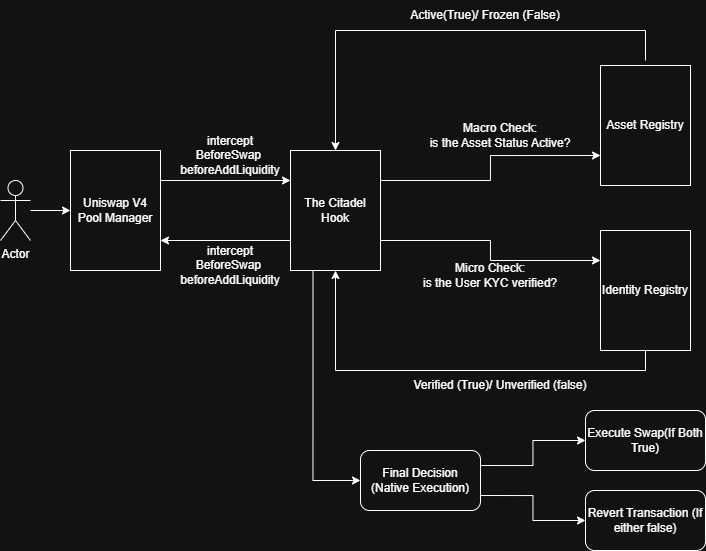
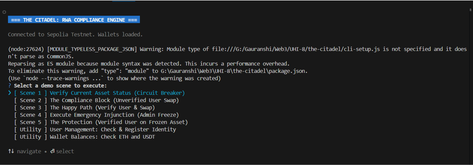
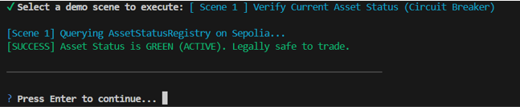
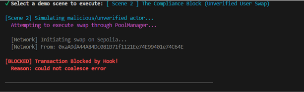
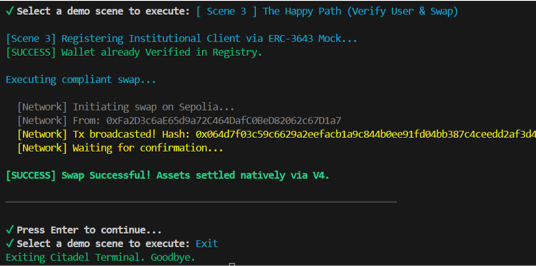
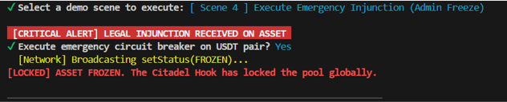
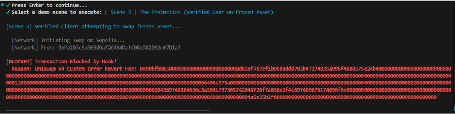
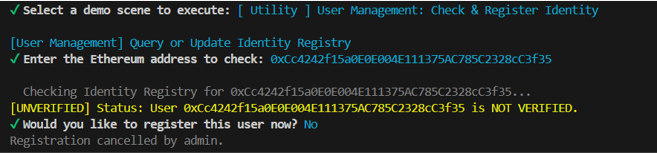
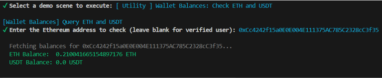
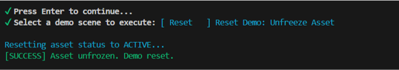

#  The Citadel

###  Demo Video

[Watch the demo](https://www.youtube.com/watch?v=uVmOuo49fmk)


## Institutional-Grade RWA Compliance Engine for Uniswap v4

The Citadel is a comprehensive, hub-and-spoke security layer designed to bring institutional Real World Asset (RWA) compliance to decentralized finance. Built natively as a Uniswap v4 Hook, it enforces strict legal and identity requirements before any swap or liquidity addition can execute.

##  The "Check-Then-Execute" Architecture

Traditional finance regulations demand KYC/AML verification, accredited investor checks, and the ability to freeze assets under legal injunction. The Citadel implements this natively in the liquidity pool through a two-pronged check:

- **The Circuit Breaker (Macro Check)**: Is the asset legally safe to trade?
- **The Compliance Gate (Micro Check)**: Is this specific user authorized to interact with it?

When a user initiates a transaction, the CitadelHook intercepts the request via the beforeSwap or beforeAddLiquidity flags. It queries two external Authority Contracts. If both return TRUE, the swap proceeds. If either fails, the transaction reverts seamlessly, protecting the pool.


###  Workflow Diagram




## Core Smart Contracts

- **CitadelHook.sol**: The Hub. A Uniswap v4 BaseHook that acts as the traffic controller, routing compliance checks before execution.
- **AssetStatusRegistry.sol**: The Circuit Breaker. An oracle storing the legal state of an asset (ACTIVE, FROZEN, LITIGATION).
- **MockIdentityRegistry.sol**: The Compliance Gate. A lightweight implementation mirroring the ERC-3643 standard to verify user KYC status.

## Partner Integrations

No partner integrations were made.

##  Getting Started

### Prerequisites

- Foundry
- Node.js (v18+)

### 1. Installation & Compilation

Clone the repository and install the necessary dependencies for both the smart contracts and the CLI interface.

```bash
git clone https://github.com/yourusername/the-citadel.git
cd the-citadel

# Install Foundry dependencies
forge install

# Install CLI dependencies
npm install
```

### 2. Running the Smart Contract Tests

The core logic is heavily tested using Foundry's PoolSwapTest architecture, simulating both verified and unverified actors, as well as active and frozen market conditions.

```bash
forge test -vvv
```

Test Coverage Includes:

- `test_BeforeSwap_Success_WhenVerified`: Validates the happy path.
- `test_BeforeSwap_Revert_WhenNotVerified`: Validates the KYC compliance block.
- `test_BeforeSwap_Revert_WhenAssetFrozen`: Validates the global circuit breaker.
- `test_BeforeAddLiquidity_*`: Validates LP compliance checks.

##  The Citadel Terminal (Interactive CLI Demo)

To demonstrate the real-world application of the hook, we built an interactive, Bloomberg-style terminal using Node.js. The CLI connects to the Sepolia testnet to execute live Uniswap v4 swaps and trigger compliance interventions in real-time.

### CLI Setup

Create a `.env` file in the root directory:

```
RPC_URL=https://eth-sepolia.g.alchemy.com/v2/YOUR_API_KEY
PRIVATE_KEY=your_admin_wallet_key
UNVERIFIED_PRIVATE_KEY=your_unverified_test_wallet_key
VERIFIED_PRIVATE_KEY=your_verified_test_wallet_key
```

### Running the Terminal

```bash
node CLI-setup.js
```

##  Demo Scenes

The CLI is pre-programmed with 5 specific scenes and 2 utility modes designed for live demonstration:

- **Status Dashboard**: Fetches live registry data to prove the asset is ACTIVE.
- **The Compliance Block**: Attempts a swap with an unverified wallet. The Hook intercepts and blocks the transaction (Citadel: User Not KYC'd).
- **The Happy Path**: Registers an institutional client on-chain and successfully executes a natively settled V4 swap.
- **Emergency Injunction**: The Admin triggers the Circuit Breaker, setting the asset to FROZEN.
- **The Protection**: A verified client attempts to trade, but the Hook intercepts the frozen asset and reverts the transaction (Citadel: Asset Frozen).
- **Utility Modes**: Includes real-time user identity management and ERC-20 token balance queries to prove state changes.

### CLI Scenarios
#### 1. CLI Menu


#### 2. Scene 1


#### 3. Scene 2


#### 4. Scene 3


#### 5. Scene 4


#### 6. Scene 5


#### 7. Utility 1


#### 8. Utility 2


#### 9. Reset

